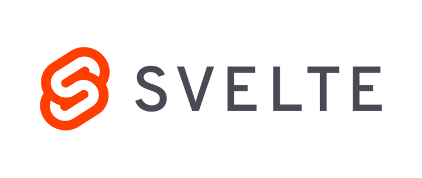

# Svelte
My works related to Svelte JavaScript framework.

## Table of Contents
1. [Introduction.](#introduction)
2. [Official references websites.](#references)
3. [Svelte developers.](#developers)
4. [GitHub notes.](#github)
5. [GitHub repository calculation.](#calculation)

<a name="introduction"></a>
## 1. Introduction.
 
Svelte is a free and open-source JavaScript framework written by Rich Harris. Svelte applications do not include framework references. Instead, building a Svelte applications generates code to manipulate the DOM, which may give better client run-time performance. Svelte has its own compiler for converting app code into client-side JavaScript at build time. It is written in TypeScript. The Svelte source code is licensed under MIT License and hosted on GitHub.

<a name="references"></a>
## 2. Official references websites. 
Svelte official website : https://svelte.dev <br />

<a name="developers"></a>
## 3. Svelte developers.
Rich Harris : https://github.com/Rich-Harris
 
<a name="github"></a>
## 4. GitHub notes.
Clone the current GitHub remote repository contents into local machine.
```
$ git clone https://github.com/syakirharis25/Svelte.git
$ cd Svelte/
$ git remote -v
$ git status
```

<a name="calculation"></a>
## 5. GitHub repository calculation.
```
draft
```
Refer to : https://github.com/syakirharis25/cloc
